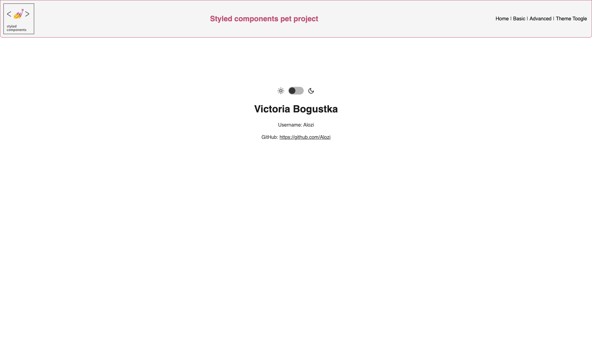

# Styled-Components Practice Project

A small React web project to practice using the **Styled Components** library and **React Router (react-router-dom)** for routing.



## 🚀 Features

- ✅ Styled components library
- ✅ Routing with `react-router-dom`
- ✅ React Dark Theme Toggle With Styled Components
- ✅ Clean and minimal UI

## 🛠️ Getting Started

### 1. Clone the repository

```bash
git clone https://github.com/Alozi/styled-components.git
cd material-ui
```

### 2.Install dependencies and run project locally

```bash
npm install
npm run dev
```

### Folder structure 

```bash
.
├── public/
├── src/
│   ├── assets/
│   ├── components/
│   │  ├── icons/
│   ├── pages/
│   ├── styles/
│   └── App.js
├── package.json
└── README.md
```
